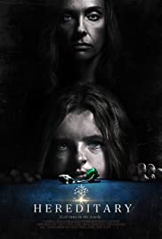
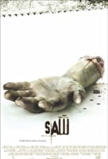

## a tiny horror movie list 

Title (year) | Storyline | IMDb Rating | Genres | Directors
------------ | --------- | ----------- | ------ | ----------
[Us (2019)](https://www.imdb.com/title/tt6857112) | A family's serene beach vacation turns to chaos when their doppelgängers appear and begin to terrorize them. | 6.0 | Horror, Mystery, Thriller | Jordan Peele
[Get Out (2017)](https://www.imdb.com/title/tt5052448/) |A young African-American visits his white girlfriend's parents for the weekend, where his simmering uneasiness about their reception of him eventually reaches a boiling point.| 7.7 | Horror, Mystery, Thriller | Jordan Peele
[A Quiet Place (2018)](https://www.imdb.com/title/tt6644200/) |In a post-apocalyptic world, a family is forced to live in silence while hiding from monsters with ultra-sensitive hearing.| 7.5 | Drama, Horror, Sci-Fi | John Krasinski
[Dead Calm (1989)](https://www.imdb.com/title/tt0097162/) |After a tragedy, John Ingram and his wife Rae are spending some time isolated at sea, when they come across a stranger who has abandoned a sinking ship.| 6.8 | Horror, Thriller | Phillip Noyce
[Pi (1998)](https://www.imdb.com/title/tt0138704/) |A paranoid mathematician searches for a key number that will unlock the universal patterns found in nature.| 7.4 | Drama, Horror, Mystery, Sci-Fi, Thriller | Darren Aronofsky
[28 Days Later... (2002)](https://www.imdb.com/title/tt0289043/) |Four weeks after a mysterious, incurable virus spreads throughout the UK, a handful of survivors try to find sanctuary.| 6.7 | Drama, Horror, Sci-Fi | Danny Boyle
[28 Weeks Later (2007)](https://www.imdb.com/title/tt0463854/) |Six months after the rage virus was inflicted on the population of Great Britain, the US Army helps to secure a small area of London for the survivors to repopulate and start again. But not everything goes according to plan.| 7 | Action, Horror, Sci-Fi | Juan Carlos Fresnadillo
[The Blair Witch Project (1999)](https://www.imdb.com/title/tt0185937/) |Three film students vanish after traveling into a Maryland forest to film a documentary on the local Blair Witch legend, leaving only their footage behind.| 6.5 | Horror, Mystery | Eduardo Sánchez, Daniel Myrick
[Split (2016)](https://www.imdb.com/title/tt4972582/) |Three girls are kidnapped by a man with a diagnosed 23 distinct personalities. They must try to escape before the apparent emergence of a frightful new 24th.
| 7.3 | Horror, Thriller | M. Night Shyamalan
[Planet Terror (2007)](https://www.imdb.com/title/tt1077258/) |After an experimental bio-weapon is released, turning thousands into zombie-like creatures, it's up to a rag-tag group of survivors to stop the infected and those behind its release.| 7.1 | Action, Adventure, Comedy | Robert Rodriguez
[Death Proof (2007)](https://www.imdb.com/title/tt1028528/) |Two separate sets of voluptuous women are stalked at different times by a scarred stuntman who uses his "death proof" cars to execute his murderous plans.| 7.0 | Action, Adventure, Thriller | Quentin Tarantino
[Jacob's Ladder (1990)](https://www.imdb.com/title/tt0099871/) |Mourning his dead child, a haunted Vietnam War veteran attempts to uncover his past while suffering from a severe case of dissociation. To do so, he must decipher reality and life from his own dreams, delusions, and perceptions of death.| 7.5 | Drama, Horror, Mystery | Adrian Lyne
[The Ring (2002)](https://www.imdb.com/title/tt0298130/) |A journalist must investigate a mysterious videotape which seems to cause the death of anyone one week to the day after they view it.| 7.1 | Horror, Mystery | Gore Verbinski
[Carrie (1976)](https://www.imdb.com/title/tt0074285/) |Carrie White, a shy, friendless teenage girl who is sheltered by her domineering, religious mother, unleashes her telekinetic powers after being humiliated by her classmates at her senior prom.| 7.4 | Horror | Brian De Palma
[The Shining (1980)](https://www.imdb.com/title/tt0081505/) |A family heads to an isolated hotel for the winter where a sinister presence influences the father into violence, while his psychic son sees horrific forebodings from both past and future.| 8.4 | Drama, Horror | Stanley Kubrick
[The Devil's Rejects (2005)](https://www.imdb.com/title/tt0395584/) |The murderous, backwoods Firefly family take to the road to escape the vengeful Sheriff Wydell, who is not afraid of being as ruthless as his target.| 6.8 | Horror | Rob Zombie
[Identity (2003)](https://www.imdb.com/title/tt0309698/) |Stranded at a desolate Nevada motel during a nasty rain storm, ten strangers become acquainted with each other when they realize that they're being killed off one by one.| 7.3 | Mystery, Thriller | James Mangold
[The Texas Chainsaw Massacre (2003)](https://www.imdb.com/title/tt0324216/) |After picking up a traumatized young hitchhiker, five friends find themselves stalked and hunted by a deformed chainsaw-wielding loon and his family of equally psychopathic killers.| 6.2 | Horror | Marcus Nispel
[The Texas Chainsaw Massacre (1974)](https://www.imdb.com/title/tt0072271/) |Two siblings and three of their friends en route to visit their grandfather's grave in Texas end up falling victim to a family of cannibalistic psychopaths and must survive the terrors of Leatherface and his family.| 7.5 | Horror | Tobe Hooper
[Hereditary (2018)](https://www.imdb.com/title/tt7784604/) |A grieving family is haunted by tragic and disturbing occurrences.| 7.3 | Drama, Horror, Mystery | Ari Aster
[Saw (2004)](https://www.imdb.com/title/tt0387564/) |Two strangers awaken in a room with no recollection of how they got there, and soon discover they're pawns in a deadly game perpetrated by a notorious serial killer.| 7.6 | Horror, Mystery | James Wan
[Cube (1997)](https://www.imdb.com/title/tt0123755/) |Six complete strangers with widely varying personalities are involuntarily placed in an endless maze containing deadly traps.| 7.2 | Drama, Mystery, Sci-Fi | Vincenzo Natali
