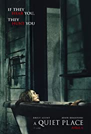
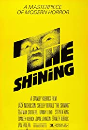
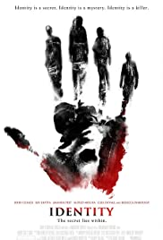

## a tiny horror movie list 

Title (year) | Storyline | IMDb Rating | Genres | Directors
------------ | --------- | ----------- | ------ | ----------
[Us (2019)](https://www.imdb.com/title/tt6857112) | A family's serene beach vacation turns to chaos when their doppelgängers appear and begin to terrorize them. | 6.0 | Horror, Mystery, Thriller | Jordan Peele
[Get Out (2017)](https://www.imdb.com/title/tt5052448/) |A young African-American visits his white girlfriend's parents for the weekend, where his simmering uneasiness about their reception of him eventually reaches a boiling point.| 7.7 | Horror, Mystery, Thriller | Jordan Peele
[A Quiet Place (2018)](https://www.imdb.com/title/tt6644200/) |In a post-apocalyptic world, a family is forced to live in silence while hiding from monsters with ultra-sensitive hearing.| 7.5 | Drama, Horror, Sci-Fi | John Krasinski
[Dead Calm (1989)](https://www.imdb.com/title/tt0097162/) | 6.8 | Horror, Thriller | Phillip Noyce
[Pi (1998)](https://www.imdb.com/title/tt0138704/) | 7.4 | Drama, Horror, Mystery, Sci-Fi, Thriller | Darren Aronofsky
[28 Days Later... (2002)](https://www.imdb.com/title/tt0289043/) | 6.7 | Drama, Horror, Sci-Fi | Danny Boyle
[28 Weeks Later (2007)](https://www.imdb.com/title/tt0463854/) | 7 | Action, Horror, Sci-Fi | Juan Carlos Fresnadillo
[The Blair Witch Project (1999)](https://www.imdb.com/title/tt0185937/) | 6.5 | Horror, Mystery | Eduardo Sánchez, Daniel Myrick
[Split (2016)](https://www.imdb.com/title/tt4972582/) | 7.3 | Horror, Thriller | M. Night Shyamalan
[Planet Terror (2007)](https://www.imdb.com/title/tt1077258/) | 7.1 | Action, Adventure, Comedy | Robert Rodriguez
[Death Proof (2007)](https://www.imdb.com/title/tt1028528/) | 7.0 | Action, Adventure, Thriller | Quentin Tarantino
[Jacob's Ladder (1990)](https://www.imdb.com/title/tt0099871/) | 7.5 | Drama, Horror, Mystery | Adrian Lyne
[The Ring (2002)](https://www.imdb.com/title/tt0298130/) | 7.1 | Horror, Mystery | Gore Verbinski
[Carrie (1976)](https://www.imdb.com/title/tt0074285/) | 7.4 | Horror | Brian De Palma
[The Shining (1980)](https://www.imdb.com/title/tt0081505/) | 8.4 | Drama, Horror | Stanley Kubrick
[The Devil's Rejects (2005)](https://www.imdb.com/title/tt0395584/) | 6.8 | Horror | Rob Zombie
[Identity (2003)](https://www.imdb.com/title/tt0309698/) | 7.3 | Mystery, Thriller | James Mangold
[The Texas Chainsaw Massacre (2003)](https://www.imdb.com/title/tt0324216/) | 6.2 | Horror | Marcus Nispel
[The Texas Chainsaw Massacre (1974)](https://www.imdb.com/title/tt0072271/) | 7.5 | Horror | Tobe Hooper
[Hereditary (2018)](https://www.imdb.com/title/tt7784604/) | 7.3 | Drama, Horror, Mystery | Ari Aster
[Saw (2004)](https://www.imdb.com/title/tt0387564/) | 7.6 | Horror, Mystery | James Wan
